# PostgreSQL 17 High-Availability Cluster on Proxmox

This project automates the deployment and configuration of a resilient PostgreSQL 17 cluster within LXC containers on a Proxmox Virtual Environment.

## Project Overview
The automation pipeline streamlines the transition from bare-metal/virtualized infrastructure to a fully functional database cluster using a "Push-Button" deployment approach.

### Key Components
*   **Orchestration**: A central `run.sh` script manages the execution lifecycle.
*   **Provisioning**: **Terraform** utilizes the Proxmox API to define and create LXC containers as code.
*   **Configuration Management**: **Ansible** performs post-provisioning tasks, including OS hardening, PostgreSQL 17 installation, and streaming replication setup.
*   **Database Architecture**: A high-availability topology featuring one **Primary** node and two **Synchronous/Asynchronous Replicas**.

## Workflow
1.  **Infrastructure Provisioning**: Terraform creates the LXC instances on the Proxmox server.
2.  **Software Configuration**: Ansible installs PostgreSQL and configures the primary-replica relationship.
3.  **Validation**: The system ensures all nodes are synchronized and the cluster is ready for traffic.

```mermaid
%%{init: {'theme': 'default'}}%%
flowchart TD
    %% Styles
    classDef hardware fill:#e1f5fe,stroke:#01579b,stroke-width:2px;
    classDef script fill:#f3e5f5,stroke:#4a148c,stroke-width:2px,stroke-dasharray: 5 5;
    classDef infra fill:#fff3e0,stroke:#e65100,stroke-width:2px;
    classDef db fill:#e8f5e9,stroke:#1b5e20,stroke-width:2px;

    subgraph LocalMachine ["🖥️ Your Machine (Control Node)"]
        direction TB
        RunScript["📜 ./run.sh"]:::script
        Terraform["🏗️ Terraform"]:::script
        Ansible["⚙️ Ansible"]:::script
        
        RunScript -->|1. Starts| Terraform
        RunScript -->|3. Starts| Ansible
    end

    subgraph ProxmoxServer ["🏢 Proxmox Server"]
        API["🔌 Proxmox API"]:::infra
        
        subgraph LXC_Cluster ["📦 LXC Cluster"]
            Primary["🐘 Primary DB 
                    (PostgreSQL 17)"]:::db
            Replica1["🐘 Replica 1 
                    (PostgreSQL 17)"]:::db
            Replica2["🐘 Replica 2
                    (PostgreSQL 17)"]:::db
        end
    end

    %% Terraform Flow
    Terraform -->|2. Provisions via API Token| API
    API -.->|Creates| Primary
    API -.->|Creates| Replica1
    API -.->|Creates| Replica2

    %% Ansible Flow
    Ansible -->|4. Install & Configures| Primary
    Ansible -->|4. install & Configures| Replica1
    Ansible -->|4. install & Configures| Replica2
```

